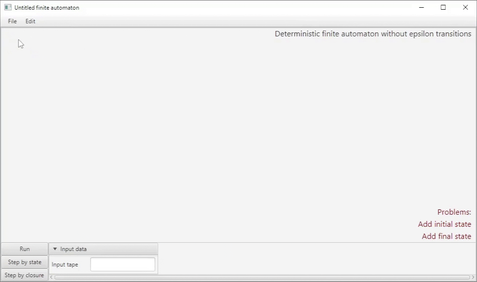
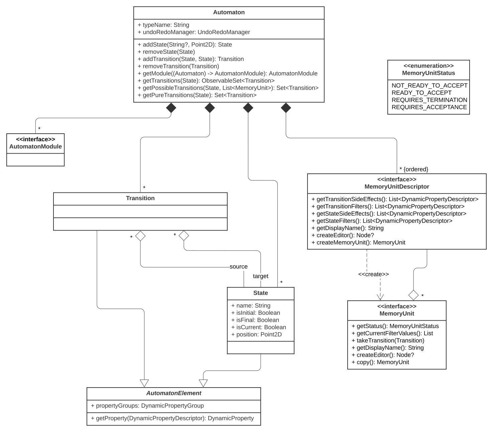

# Automaton Constructor

Automaton editing, visualization, simulation and analyzing desktop software



## Table of contents

* [Features](#features)
* [User guide](#user-guide)
* [Architecture](#architecture)
* [Build](#build)
* [Technologies](#technologies)
* [License](#license)

## Features

* Automaton types
    - DFA, NFA, epsilon-NFA
    - PDA, n-PDA, DPDA, n-DPDA
    - Register automaton
    - Mealy machine
    - TM, multi-tape TM, multi-track TM, TM with registers
* Automaton graph editing and visualization
    - State and transition addition, editing, and deletion
    - State moving
    - Group selection
    - Graph pane zooming and scrolling
* Simulation
    - Instant simulation
    - Step by state simulation
    - Step by closure simulation
* Other features
    - Non determinism detection
    - Epsilon-transition detection
    - Problem detection

## User guide

[User guide](https://docs.google.com/document/d/1jhqQSpF-SMvZJMpAzzRWi49u15uQ_wBPstUS369gO-Y/edit?usp=sharing) (in
Russian).

## Architecture

Model core class diagram:


## Build

To build this project, you must use JDK 1.8 with JavaFX (`jfxrt.jar`) package installed (e.g.
[Oracle JDK 1.8](https://www.oracle.com/java/technologies/downloads/#java8)). 

Build:
```shell
./gradlew build
```  
Run:
```shell
./gradlew run
```  

## Technologies

**UI:** JavaFX, TornadoFX

## License

[Apache-2.0](LICENSE)
