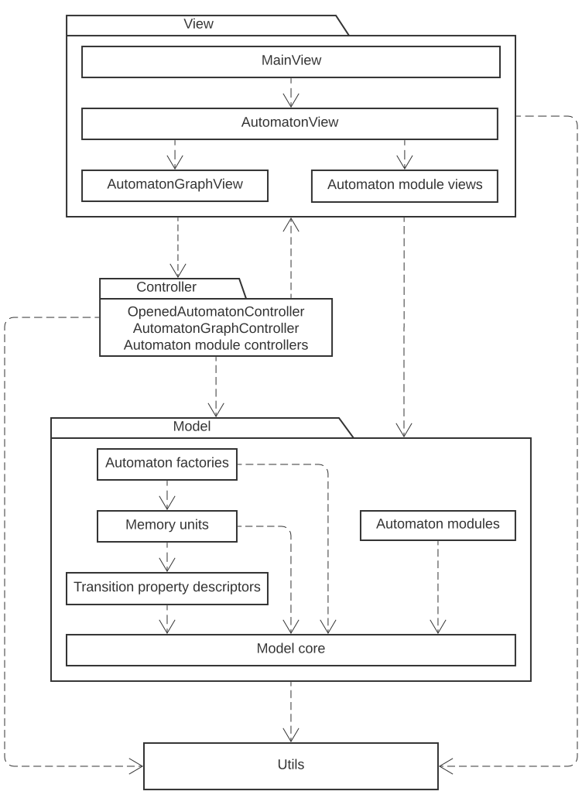

# Automata Constructor

Automata Constructor is a desktop software solution for automata editing, visualization, simulation, and analysis.

## Table of contents

* [User guide](#user-guide)
* [Features](#features)
* [Architecture](#architecture)
* [Build system](#build-system)
* [Technologies](#technologies)
* [License](#license)

## User guide

A comprehensive user guide is available in Russian in the [Wiki of this repository](https://github.com/spbu-se/KotlinAutomataConstructor/wiki/%D0%91%D1%8B%D1%81%D1%82%D1%80%D1%8B%D0%B9-%D1%81%D1%82%D0%B0%D1%80%D1%82).

## Features

* Automata types
    - DFA, NFA, epsilon-NFA
    - PDA, n-PDA, DPDA, n-DPDA
    - Register automaton
    - Mealy machine, Moore machine
    - Turing Machine (TM), multi-tape TM, multi-track TM, TM with registers
      - Support building blocks
* Automaton graph editing and visualization
    - State and transition addition, editing, and deletion
    - State moving
    - Automatically laying out automaton graph
    - Group selection
    - Graph pane zooming and scrolling
    - Undoing and redoing performed operations
* Simulation
    - Instant simulation
    - Step-by-state simulation
    - Step-by-closure simulation
    - Execution tree
    - Advancing and restarting execution for individual execution states
    - Freezing executions states
    - Viewing execution states associated with a given state
* Transformations
    - Determinization of finite automata
    - Minimization of finite automata
    - Conversion of regular expression to finite automata
    - Elimination of epsilon-transitions
    - Conversion of Mealy machine to Moore machine
    - Conversion of Moore machine to Mealy machine
* Other features
    - Non determinism detection
    - Epsilon-transition detection
    - Problem detection
    - Serialization

## Architecture

Model core class diagram:

Component diagram:

## Build system

To build this project, you must use JDK 11+.

This project uses Gradle build system. Here are commands for some of its most important tasks:

| Command (Windows)    | Description                              |
|----------------------|------------------------------------------|
| `./gradlew assemble` | Builds without tests                     |
| `./gradlew run`      | Runs the application                     |
| `./gradlew test`     | Runs the unit tests                      |
| `./gradlew msi`      | Builds .msi installer for 64-bit Windows |
| `./gradlew tasks`    | Displays all runnable tasks              |

When running Gradle task you can specify target platform classifier with `-Pplatform={classifier}` option,
the following classifiers are supported: `win`, `linux`, `mac`, `win-x86`, `linux-aarch64`, `mac-aarch64`. 

## Technologies

**UI:** JavaFX, TornadoFX

**Serialization:** kotlinx.serialization

**Build system:** Gradle

**Tests:** JUnit5, MockK

## License

The Automata Constructor is licensed under the Apache-2.0 license, as detailed in the [LICENSE](LICENSE) file.

